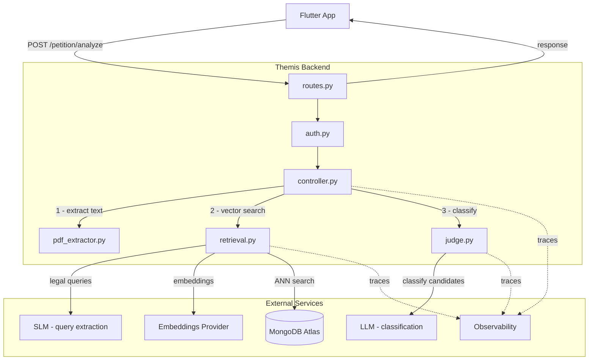

# Themis Backend

Bem-vindo ao Themis-back, a API Backend para análise e pesquisa de precedentes jurídicos. Este projeto, desenvolvido pela Equipe Skyfall, utiliza Python para oferecer um serviço robusto e escalável. Siga os passos abaixo para configurar e rodar o projeto localmente.

## Requisitos

- Python 3.10+
- MongoDB Atlas com um índice vetorial configurado
- Chave de API para um provedor de LLMs
- Conta no Langfuse (observabilidade)

## Como Executar Localmente

### 1. Clone o repositório

```bash
git clone <url-do-repositório>
cd themis-back
```

### 2. Instale as dependências

```bash
pip install -r requirements.txt
```

### 3. Configure as variáveis de ambiente

```bash
cp .env.example .env
```

Preencha os valores no `.env`.

### 4. Inicie o servidor

```bash
python run.py
```

O servidor sobe em `http://localhost:8000`.

## Autenticação

Todos os endpoints exigem um JWT emitido pelo microserviço de autenticação.

```
Authorization: Bearer <token>
```

O token é validado localmente usando o `JWT_SECRET` compartilhado entre os serviços. Nenhuma chamada ao serviço de autenticação é feita em tempo de execução.

## Documentação da API

Com o servidor em execução, acesse a documentação interativa em:

- **Swagger UI**: `http://localhost:8000/docs`

## Endpoints

### `POST /petition/analyze`

Recebe um PDF de petição e retorna os precedentes jurídicos mais relevantes, classificados por aplicabilidade.

**Parâmetros:**
- `file` (multipart/form-data) — PDF da petição

**Response:**
```json
{
  "results": [
    {
      "id": "string",
      "tipo": "string | null",
      "orgao": "string | null",
      "tese": "string | null",
      "questao": "string | null",
      "textoEmenta": "string | null",
      "textoDecisao": "string | null",
      "relevance_label": "aplicavel | possivelmente aplicavel | nao aplicavel",
      "explanation": "string | null",
      "confidence_score": "number | null"
    }
  ]
}
```

| Campo | Descrição |
|---|---|
| `relevance_label` | Classificação do juiz LLM |
| `explanation` | Justificativa de uma frase |
| `confidence_score` | Confiança do sistema na classificação (0–100): 70% peso do rótulo + 30% peso da similaridade semântica |


**Parâmetros:**
- `file` (multipart/form-data) — PDF da petição
- `expected_id` (form) — ID do precedente correto

Retorna as métricas de avaliação: `retrieved`, `retrieval_rank`, `pipeline_rank`, `classification`, `hit_at_k`, `reciprocal_rank`. Consulte [EVALUATION.md](./EVALUATION.md) para a explicação detalhada de cada métrica.


## Arquitetura



**Pipeline por requisição:**
1. JWT validado localmente com o `JWT_SECRET` compartilhado — sem chamada ao serviço de autenticação
2. Texto extraído do PDF localmente
3. LLM extrai 3–5 queries jurídicas da petição + o sumário
4. Queries + petição completa são embedadas em uma única chamada batch à OpenAI
5. Cada embedding executa uma busca vetorial no MongoDB Atlas
6. Top-N candidatos enviados ao juiz LLM para classificação
7. Resultados ranqueados por aplicabilidade e retornados com `confidence_score`

## Estrutura do Projeto

```
themis/
├── app.py              # Inicialização do FastAPI
├── auth.py             # Validação do JWT (dependência compartilhada)
├── config.py           # Variáveis de ambiente, clientes e registry de providers
├── controller.py       # Orquestração do pipeline
├── routes.py           # Definição das rotas
├── models/
│   └── responses.py    # Modelos de resposta (Pydantic)
└── services/
    ├── pdf_extractor.py # Extração de texto do PDF
    ├── providers.py     # Strategy pattern para providers LLM
    ├── retrieval.py     # Busca vetorial no Atlas
    ├── judge.py         # Classificação dos precedentes via LLM
    └── evaluator.py     # Cálculo de métricas e logging 

run.py                  # Ponto de entrada (uvicorn)
requirements.txt
.env.example
```


## Licença

MIT
